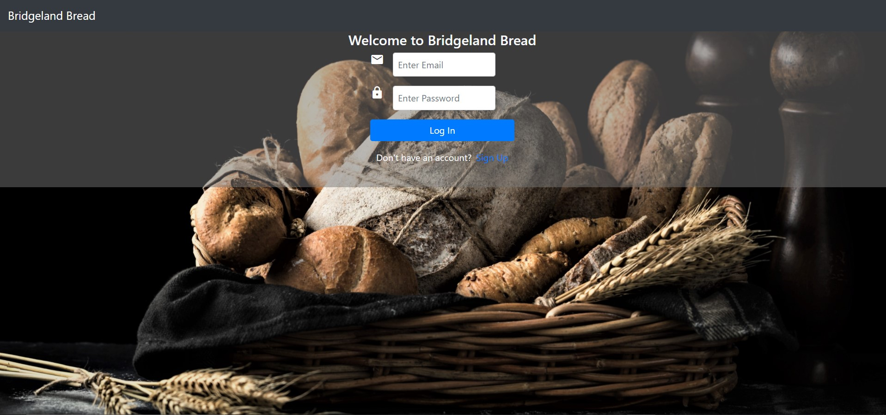
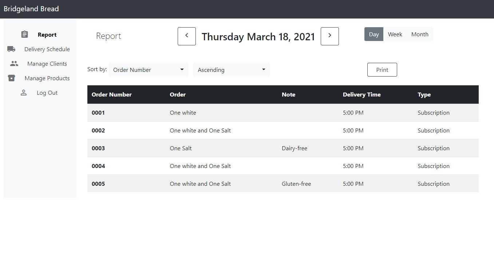
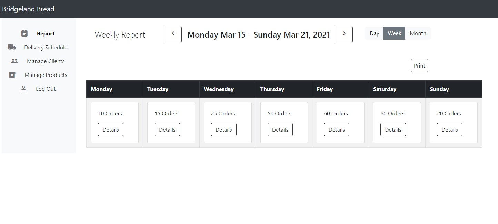
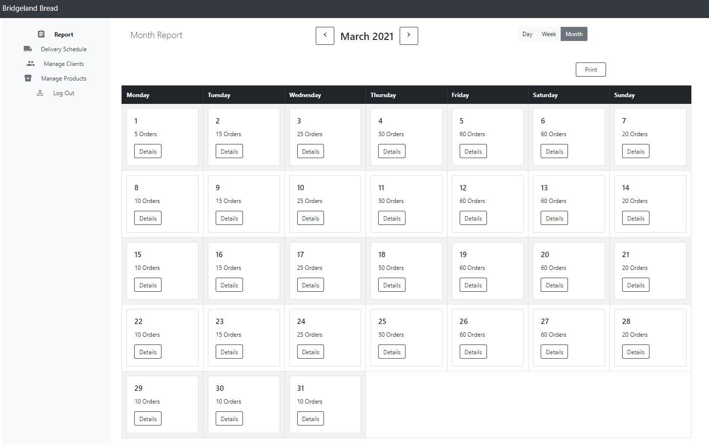
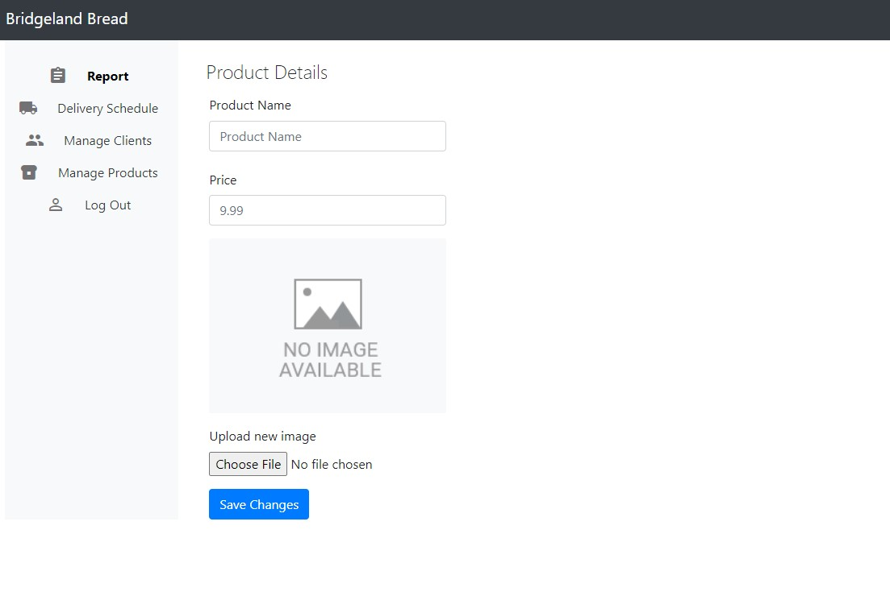
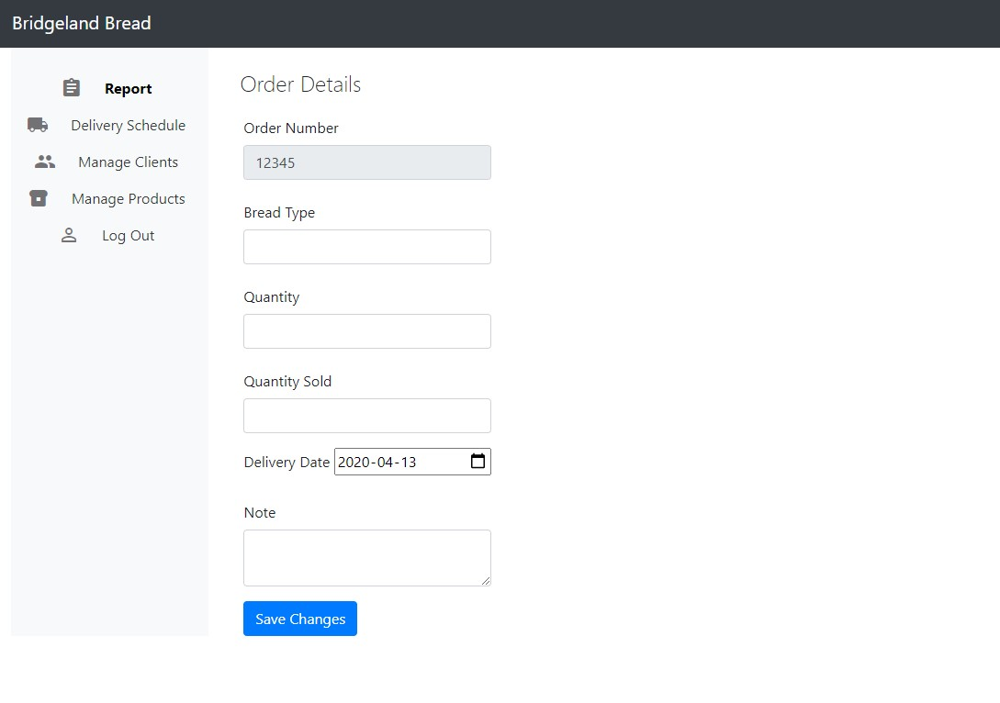
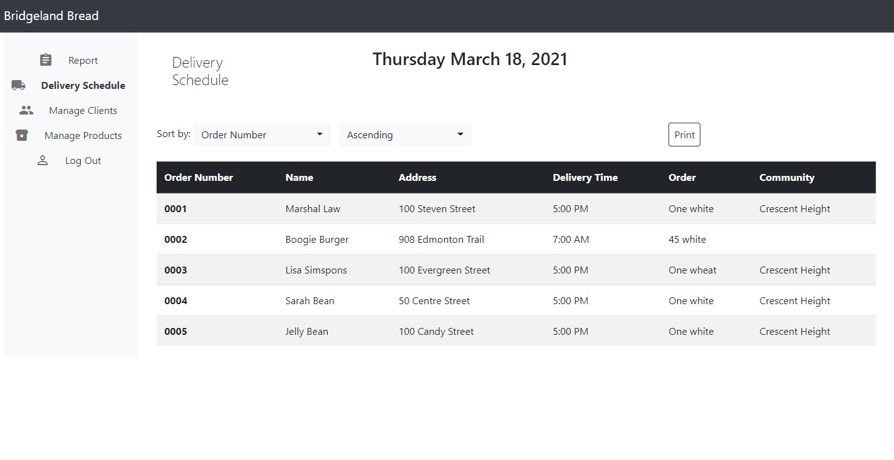
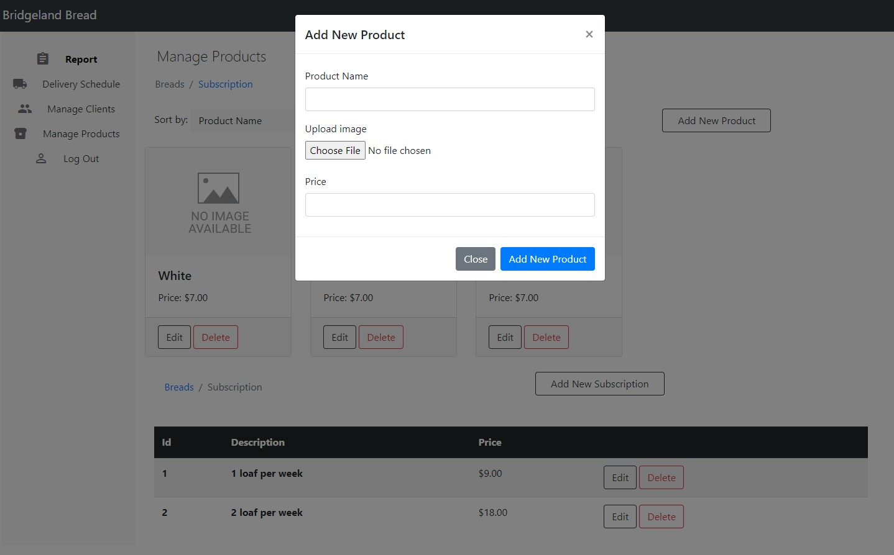

# PROJ 354 - Frontend Files of Bridgeland Bakery's Customer Management System

## Description

This repo host frontend files I was responsible for implementing for my Group's Capstone Project.

## About the project

Bridgeland Bakery is an online only bread subscription business and they were interested in a proof-of-concept to be
made for a customer management system. The system was to help the client manage their commerical and subscription clients.

The following technologies was used to implement this system: JavaServer Pages, Bootstrap 4, HTML5/CSS3, Java Servlet and MySQL.

## What have I learnt from this project

- I had to learn Bootstrap 4 framework so that time spend on implementing the UI would be less and completed according to our timeline.
- As a result, I improve and practice my time management skill to account for time spend on tutorial while
  meeting the project's milestones
- How to troubleshoot issues with version control on remote repository such as GitHub
- Proper communication skills was essential to work collaborative on a remote project. For my part, I made word documents to the teammates working on backend. These documents hightlighted what methods are required, data format, query parameter names, to name a few.
- Learnt how to deal and properly manage requirement changes.

## Screenshots

